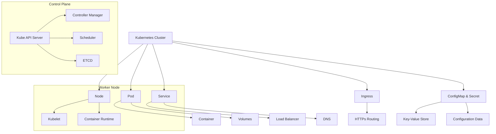

# EKS - Deployment

Deploying app on Kube, it wil have Ingress and its controller and will be accessing on ALB DNS. VPC will have Public and Private Subnets.

In kube there are 2 components:

- Control Plane (Master Node)
- Data Plane (Worker Node)

If HA is required it's recommend to go with 3 Master Nodes, each master node will have 1 EC2.

## Master Node Components

Listed components are main components which are responsible for managing the Kube Cluster. Those mentioned components are user facing components, if you want to access any app then those controller are accessed and your request goes to the data plane where the app is actually installed.

- API
- ETCD (_configuration information for large scale distributed systems_)
- Scheduler
- Cloud Control Manager
- Controller Manager

## Worker Node Components

Listed components are required for worker nodes for the deployments. Once those are installed you have to make join those worker nodes to the control plane.

- Container Network Interface
- Container Runtime
- DNS Service
- Kube Proxy

Note: _Kubeadm Reference: Kubeadm is a tool built to provide kubeadm init and kubeadm join as best-practice "fast paths" for creating Kubernetes clusters. kubeadm performs the actions necessary to get a minimum viable cluster up and running. By design, it cares only about bootstrapping, not about provisioning machines._

## EKS

The EKS is provided by AWS which is a managed service. The Control Plane part of the Kube is managed by AWS themselves. You go to AWS and get a Cluster for yourself and you get a managed control plane. It provides a very easy way to manage Control Plane.
The Master Nodes are managed by AWS themselves, you may not know where they are, for attaching the Worker Nodes there are 2 options which are provided by AWS.

TLDR; EKS is fully-managed kube service by AWS which takes your pain away (❁´◡`❁). You do not have to manage the certificates, api server slowness, ETCD crashes and more.

- Create EC2 Yourselves. (_SelfManaged, you will have to manage the number of instances you will have your deployments deployed on, if you need more compute for your deployment then you will have to deploy more EC2 instances_)
- Fargate. (_Serverless Compute for containers, the Autoscaling/HA is managed by the AWS_)

### Ways to use EKS on AWS

1. Create VMs yourself and use KOPS or Kubeadm.
2. USE EKS XD.
3. Installing Kube Cluster on-prem.

## Kube Tree

## Accessing the Pod

There are 3 ways to access a POD.

- Cluster IP (_this works only inside the Cluster_)
- Node Port (_Exposing on Node Level_)
- Load Balancer (_Exposing through the LB_)

## Notes

Exposing Pods or SVC or Ingress:

- For the Tutorial, that I had watched; doing this would require you to use the OIDC for IAM for the cluster. This will enable the pod/alb to be able to talk to the pod.
- Here, what is happening - When the controller is deployed an ALB is deployed within the Kube Environment which is exposed to the Internet and all of the traffic which is coming is handled by that pod 

## Abbreviation

- High Availability (HA)
- Application Load Balancer (ALB)
- Load Balancer (LB)
- Network Load Balancer (NLB)
- Kubernetes (Kube)
- EKS (Elastic Kubernetes Service)
